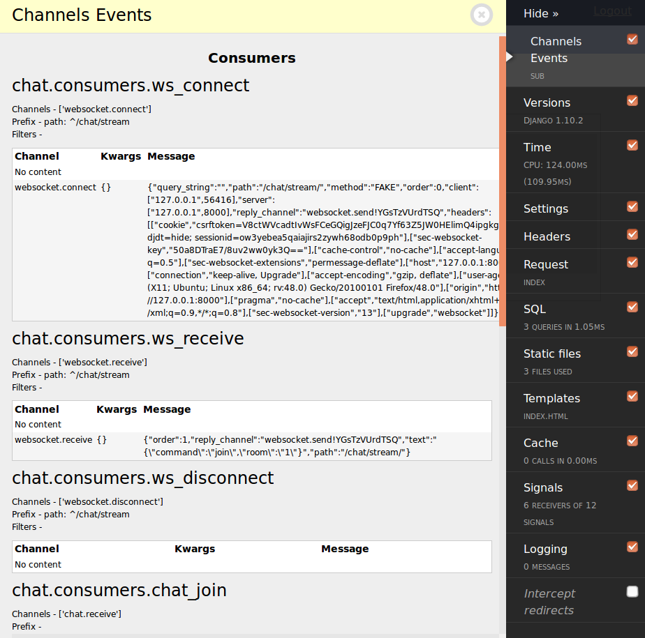

Django Channels Panel
=====================

A Django Debug Toolbar panel for Channels

About
-----

This is a panel for ``Django Debug Toolbar`` that displays channels, groups and consumers events.

Installation
------------

Install using ``pip``::

    pip install django-channels-panel

Then add ``channels_panel`` to your ``INSTALLED_APPS`` so that we can find the
templates in the panel. Also, add ``'channels_panel.panel.ChannelsDebugPanel'``
to your ``DEBUG_TOOLBAR_PANELS``.

Configuration
-------------

Use ``CHANNELS_PANEL`` for configure django-channels-panel:

Defaults::

    "ONLY_CHANNELS" -  None
    "EXCLUDE_CHANNELS" - ['http.*', ]
    "ONLY_GROUPS" - None
    "EXCLUDE_GROUPS" - ['debug' + '.*']

License
-------

Uses the `MIT`_ license.

.. _Django Debug Toolbar: https://github.com/django-debug-toolbar/django-debug-toolbar
.. _MIT: http://opensource.org/licenses/MIT
